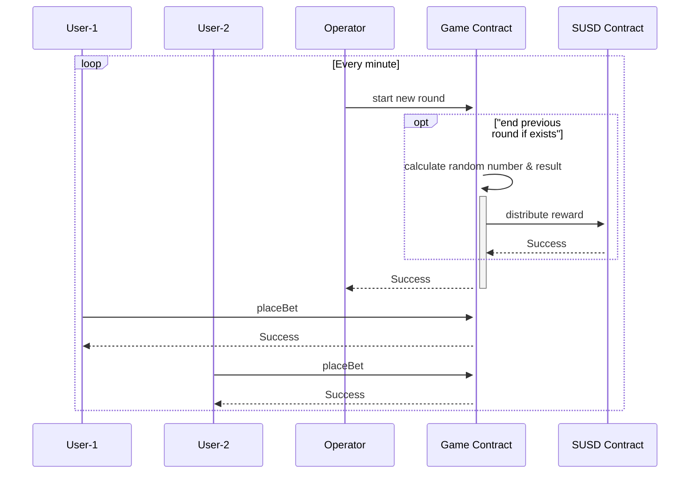
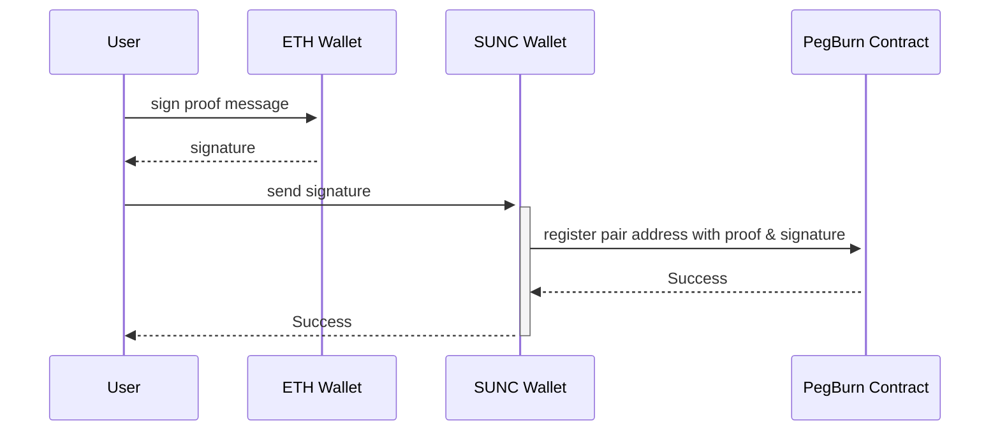
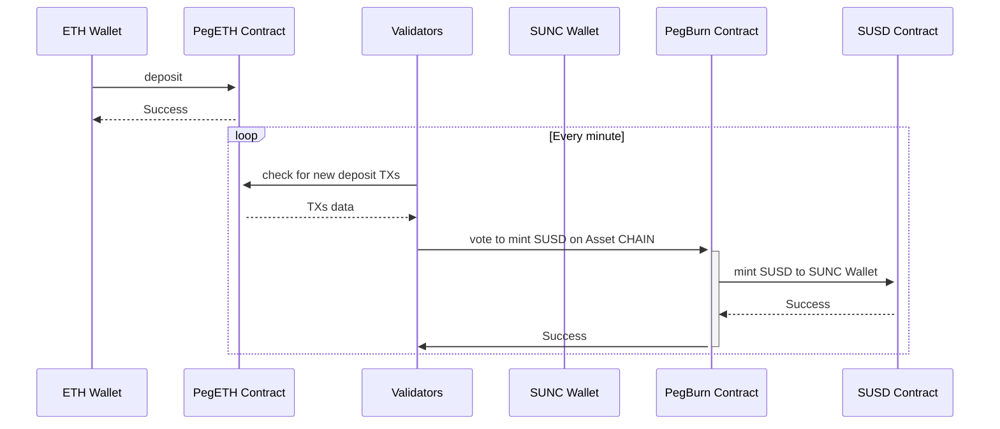
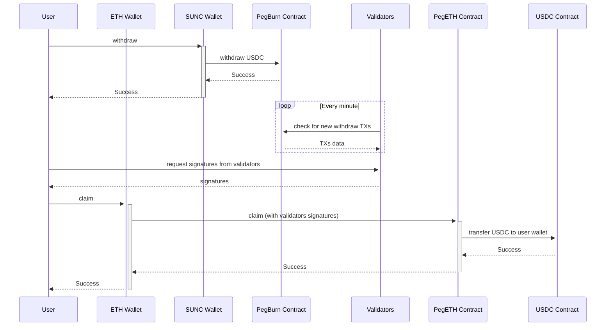
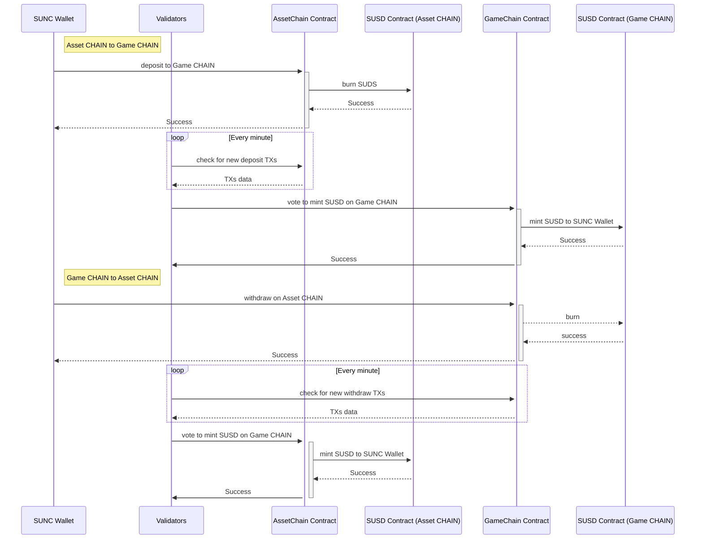

**Important notice:** The publicly available source codes may not be used, altered, copied, or distributed without permission.

# Sunrise Gaming by DAO Contracts

This repo contains all the contracts used in Sunrise Gaming by DAO. It is divided in independent projects where each of them contains its smart contracts, test environment and unique config files.


## Existing projects

| Project name                                      | Description                                                                  | Solidity version(s)      |
| ------------------------------------------------- | ---------------------------------------------------------------------------- | ------------------------ |
| [Brige Contract](./projects/bridge)               | Implementation of Bridge Contracts to convert your USDC into SUSD.           | 0.8.7                    |
| [Roulette Contract](./projects/roulette)          | Implementation of Roulette Game.                                             | 0.8.9                    |
| [Baccarat Contract](./projects/baccarat)          | Implementation of Bacarrat Game.                                             | 0.8.7                    |
| [Sic bo Contract](./projects/sicbo)               | Implementation of Sic bo Game.                                               | 0.8.11                   |
| [Dragon Tiger Contract](./projects/dragon-tiger)  | Implementation of Dragon Tiger Game.                                         | 0.8.7                    |


## How we generate random number to determine game result

- When GAME OPERATOR start new round, he send SECRET_HASH of a `SECRET_VALUE`, the `SECRET_HASH` stored in contract for later used.

- Each time player place a new bet, player send their own `HASH_VALUE`, this value is combine with `SECRET_HASH`

```
    round.random ^= seedHash;
```
- When GAME OPERATOR end a round, he send the `SECRET_VALUE` to the contract, after that a random number is calculated base on following formular

```
    require(secretHash != 0 && secretHash == getHash(currentSecretValue), INVALID_SECRET_VALUE);

    round.random ^= getHash(uint256(secretHash) ^ currentSecretValue ^ block.timestamp);
```

- This random number is used to calculate game result

```
        number = uint256(round.random) % ROULETTE_NUMBER;
```

## How it works

### Play our games

Below sequence diagram illustrate how a game round happen
- Users enjoy our game by trigger contract to place their bet.
- Game contract log user bet on our Gaming CHAIN.
- Operator are in charge of trigger contract call to start new round every minute.
- Game contract calculate the result of previous round and distribute reward (or refund) to winner of last round.
- Game contract log previous round result & winners on our Gaming CHAIN.



### Gas Refund Mechanism

Our contract run on private Asset CHAIN & Game CHAIN.
The gas is auto supplied to user's wallet right after each contract call
to make sure that users never get gas related issues for their transaction on our Gaming Network.

### Link your ETH Wallet with your SUNC Wallet

For safety reason, a separate wallet on SUNC CHAINs (including Asset CHAIN & multiple Game CHAINs) should be linked to your main ETH wallet.

The registration process is as bellow.



### Deposit USDC and get SUSD

User deposit USDC to our PegETH contract.
Regisetered validators should motinor the status of PegETH contract and votes to mint SUSD on our Asset CHAIN.

Below is simple illustration of the proccess.



### Withdraw SUSC and claim your USDC

User trigger withdraw call to our PegBurn contract.
Regisetered validators should motinor the status of PegBurn contract and issues their signatures to verify the request.
User should retrieves signatures from validators (via our [Lobby](https://lobby.sunrisegaming-dao.com/)),
then trigger the claim call to our PegETH contract.

Below is simple illustration of the proccess.



### Transfer SUSD between Asset CHAIN and Game CHAIN

In orther to play game, user need to bridge SUDC between Asset CHAIN and Game CHAIN.

Below is simple illustration of the proccess.



